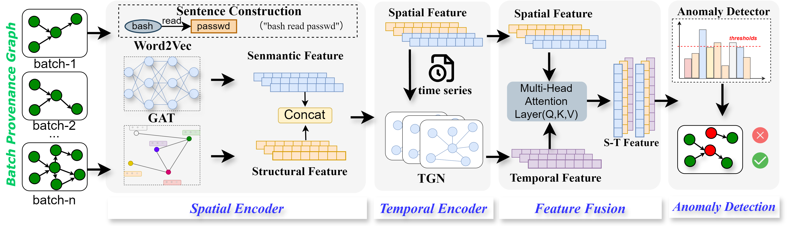

# STGAN: Detecting Host Threats via Fusion of Spatial-Temporal Features in Host Provenance Graphs

Main code for **STGAN: Detecting Host Threats via Fusion of Spatial-Temporal
Features in Host Provenance Graphs** (WWW 2025 Oral) [Our Paper](https://dl.acm.org/doi/10.1145/3696410.3714925)



---

## 📖 Overview

STGAN accepts streaming audit log input and slices the log information into segments. For each subgraph within a segment, STGAN performs both spatial and temporal embedding.  

- **Spatial Embedding**: STGAN constructs sentences based on the first-hop neighbors of each node and uses Word2Vec to learn semantic features. These semantic features are used as initial node embeddings, followed by Graph Attention Network (GAT) to extract structural information.  
- **Temporal Embedding**: STGAN employs Temporal Graph Networks (TGN) to model temporal dependencies of host activities.  
- **Fusion**: A multi-head self-attention mechanism integrates the spatial and temporal embeddings into a unified representation.  

---

## 📂 Directory Structure

- **Utils**: Contains necessary tools.  
- **data**: Includes datasets TRACE, CADETS, THEIA, and data processing tools.  
- **eval**: Contains evaluation scripts.  
- **model**: Houses graph embedding models.  
- **train**: Contains training scripts for all datasets.  

---

## 🔗 Dataset Links

- DARPA TC: [Google Drive](https://drive.google.com/open?id=1QlbUFWAGq3Hpl8wVdzOdIoZLFxkII4EK)  

---

## ⚙️ Dependencies

- Python 3.9  
- torch==1.12.0+cu113  
- torch-geometric==2.1.0  
- torch-cluster==1.6.0+pt112cu113  
- torch-scatter==2.0.9  
- torch-sparse==0.6.15+pt112cu113  
- torch-spline-conv==1.2.1+pt112cu113  
- DGL 1.0.0  
- scikit-learn==1.1.1  
- xgboost==0.90  
- gensim==4.3.0  
- networkx==3.0  

---

## 🚀 End-to-End Start

1. **Clone the repository**
   ```bash
   git clone https://github.com/your-repo/STGAN.git
   cd STGAN
2. **Set up environment**
    ```bash
    conda create -n stgan python=3.9
    conda activate stgan
    pip install -r requirements.txt
3. **Prepare datasets**
    ```bash
    python data_parser.py --dataset "trace"
4. **Train the model**
    ```bash
    python train_trace.py
5. **Evaluate**
    ```bash
    python eval_trace.py

## 🚀 Quick Start
1. **Clone the repository**
   ```bash
   git clone https://github.com/your-repo/STGAN.git
   cd STGAN
2. **Set up environment**
    ```bash
    conda create -n stgan python=3.9
    conda activate stgan
    pip install -r requirements.txt
3. **Prepare datasets**
    ```bash
    python data_parser.py --dataset "trace"
4. **Evaluate**
    ```bash
    python eval_trace.py

## 📑 Citation

If you use this repository, please cite our paper:

```bibtex
@inproceedings{sang2025stgan,
  title={STGAN: Detecting Host Threats via Fusion of Spatial-Temporal Features in Host Provenance Graphs},
  author={Sang, Anyuan and Fan, Xuezheng and Yang, Li and Wang, Yuchen and Zhou, Lu and Jia, Junbo and Yang, Huipeng},
  booktitle={Proceedings of the ACM on Web Conference 2025},
  pages={1046--1057},
  year={2025}
}
